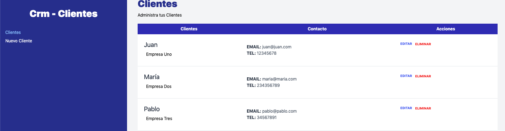

# CRM-CLIENTES


# Detalles del proyecto
 Este proyecto fue desarrollado como una herramienta de administración de clientes utilizando la biblioteca de React y la configuraciónrápida de Vite.

## Contenido
```
Gestión de Clientes: Administra la información de tus clientes de manera eficiente.
Interfaz Intuitiva: Diseño fácil de usar para una experiencia de usuario agradable.
React + Vite: Utiliza la potencia de React con la rapidez de Vite para un desarrollo eficiente.
```

### Detalles
```
Proyecto realizado con react.js para administración de clientes.
Usé Json-server para simular una api
```